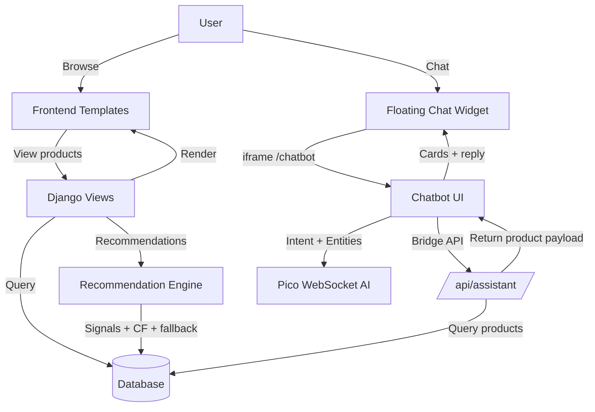
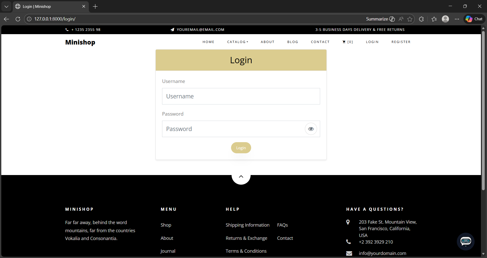
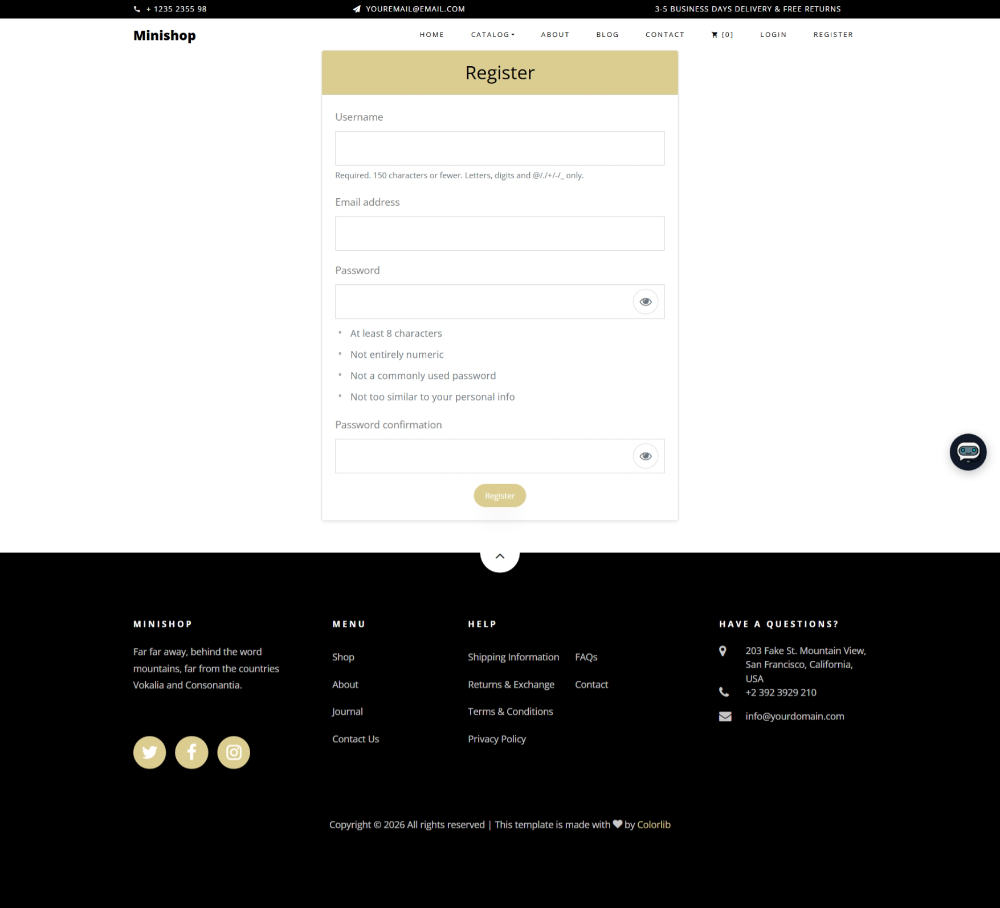
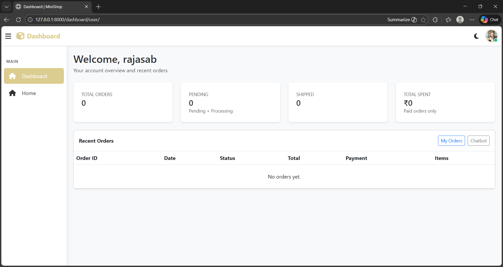
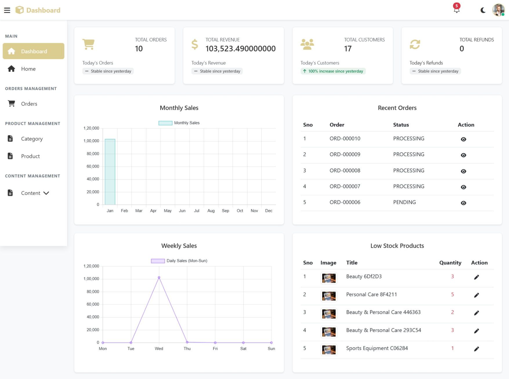
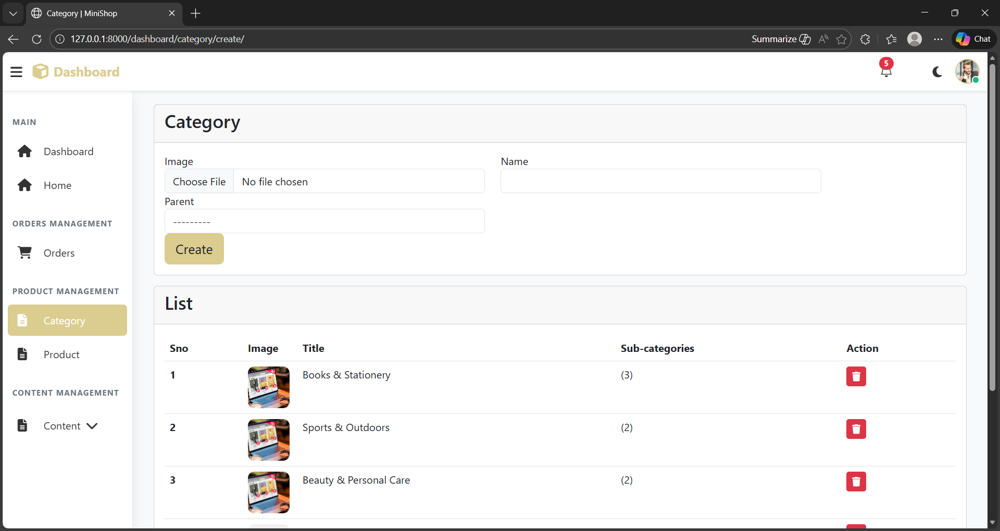
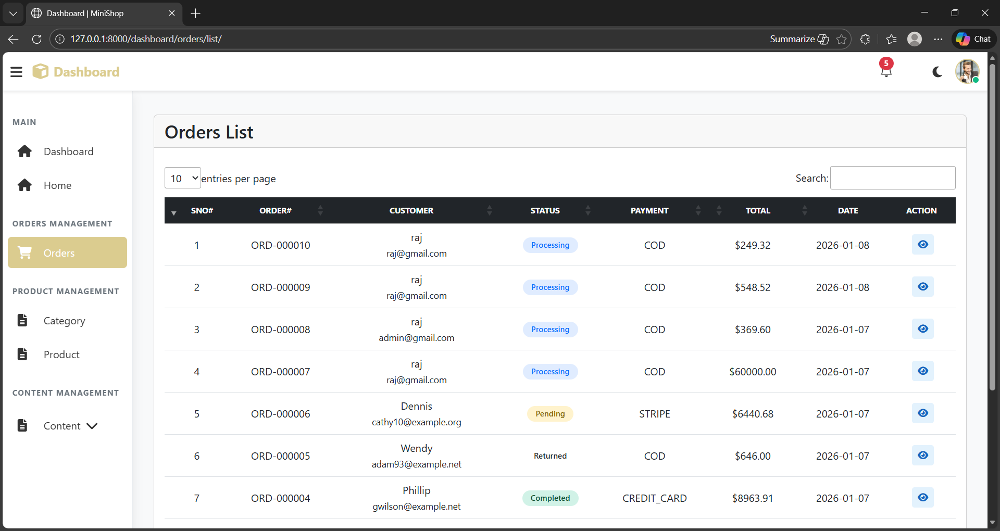

# MiniShop — Django E‑commerce + AI Shopping Assistant

MiniShop is a Django e‑commerce platform with a product catalog, cart/checkout, and a floating AI shopping assistant that bridges user intent to real product URLs.

## Table of Contents

- Features
- Architecture
- Implementation Steps
- Local Setup
- Key Components
- Observability & QA
- Screenshots

## Features

- Product catalog with categories and product detail pages
- Cart, checkout, orders, and cancellations
- Wishlist (likes) and browsing interest tracking
- Personalized recommendations on home and product pages
- Floating AI chatbot (iframe) for product discovery and purchase links

## Tech Stack

- Backend: Django
- Database: SQLite (dev), configurable for production
- Frontend: Django templates + Tailwind + Bootstrap
- Realtime AI: Pico WebSocket (chatbot)

## Architecture

Mermaid diagram (rendered on GitHub):

## Implementation Steps

1) **Core E‑commerce**
   - Models: products, categories, cart, orders
   - Views/templates for home, shop, product detail, checkout
2) **Recommendations**
   - Signals: likes, purchases, cart, interest decay, cancelled orders
   - Collaborative filtering + category fallback + anonymous fallback
   - Cached results with per‑user invalidation
3) **AI Shopping Assistant**
   - Floating widget in `home/templates/home/base.html`
   - Chatbot UI in `home/templates/home/chatbot.html`
   - Pico AI for intent + response
   - Bridge API `/api/assistant/` for DB search + real links
4) **QA & Observability**
   - Chatbot QA script (`home/static/home/js/chatbot_qa.js`)
   - Recommendation diagnostics under `RECS_OBS=1`

## Local Setup

1) Copy env template (optional): `cp .env.example .env`
2) Install deps: `python3 -m pip install -r requirements.txt`
3) Apply migrations: `python3 manage.py migrate`
4) Run server: `python3 manage.py runserver`

## Key Components

- **Recommendation Engine**  
  `shop/recommendations.py:get_recommended_products`  
  Inputs: likes, purchases, cart, interest decay, cancelled orders.  
  Outputs: ordered product queryset (max `n`), diversity‑capped per category.

- **Home Recommendations**  
  `home/views.py:home` → `home/templates/home/index.html`

- **Product Detail Recommendations**  
  `shop/views.py:product_detail` → `shop/templates/shop/product_detail.html`

- **AI Chatbot UI**  
  `home/templates/home/chatbot.html` (iframe)

- **Bridge Layer**  
  `home/assistant_bridge.py` + `home/views.py:assistant_api`

## Observability & QA

- Enable recommendation diagnostics logging:
  - `RECS_OBS=1 python3 manage.py runserver`
- Chatbot QA summary:
  - Load `/static/home/js/chatbot_qa.js` in the console
  - Output includes `[PASS]`, `[FAIL]`, `[INFO]`, and `[SUMMARY]`

## Screenshots

Home

| Screenshot | Preview |
| --- | --- |
| Home page |  |

Authentication

| Screenshot | Preview |
| --- | --- |
| Login |  |
| Register |  |

User

| Screenshot | Preview |
| --- | --- |
| User dashboard |  |

Admin

| Screenshot | Preview |
| --- | --- |
| Admin dashboard |  |
| Admin product list |  |
| Admin category |  |
| Admin orders |  |
